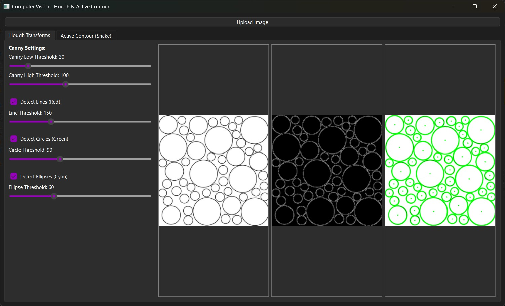
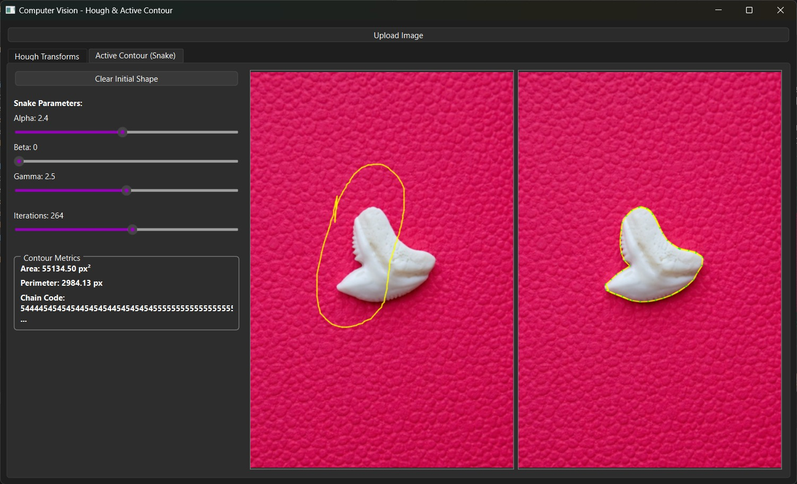
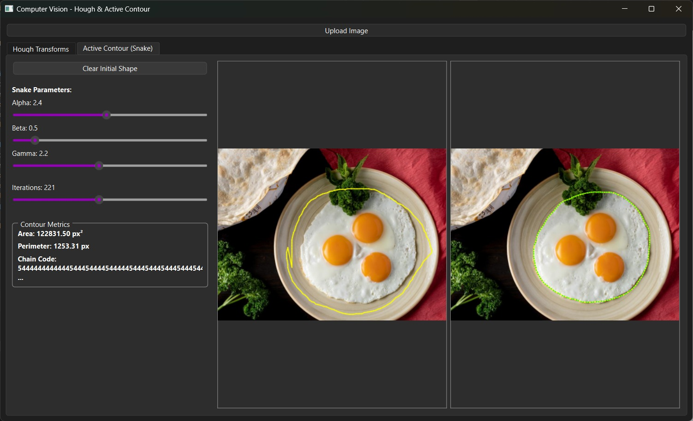

# 👁️ Computer Vision: Edge & Shape Detection Pipeline (C++ / Qt)

## 📌 Project Overview
A comprehensive desktop application developed in **C++** using the **Qt Framework**. This project implements core Computer Vision algorithms from scratch, focusing on edge detection, geometric shape recognition, and contour tracking through mathematical energy minimization.

## ⚙️ Core Algorithms Implemented

### 1. Canny Edge Detector
Implemented the complete 5-step Canny edge detection pipeline from scratch:
* Gaussian Blur for noise reduction.
* Sobel Gradients (Magnitude & Angle computation).
* Non-Maximum Suppression (Edge thinning).
* Double Thresholding.
* Edge Tracking by Hysteresis.

### 2. Hough Transform (Shape Detection)
* **Hough Circles:** Utilizes a highly optimized accumulator to detect circular shapes.
* **Hough Ellipses & Lines:** Extracts generalized geometric shapes from binary edge maps by mapping pixels to parameter space.

### 3. Active Contours (Snakes)
Implemented an iterative energy-minimizing spline model for contour tracking and image segmentation. The contour actively snaps to object boundaries by minimizing the total energy:
$$E_{total} = \alpha E_{cont} + \beta E_{curv} + \gamma E_{img}$$
Where $E_{cont}$ enforces continuity, $E_{curv}$ enforces smoothness, and $E_{img}$ pulls the snake toward image edges (computed via Gaussian blurring and Canny edge distance transforms).

---

## 📸 Application Output Gallery

### 1. Hough Transform: Multi-Shape Detection (Lines & Circles)
Simultaneous detection and overlay of multiple geometric primitives.


### 2. Hough Transform: Circle Detection
Robust detection of circular shapes using a custom accumulator.



### 3. Hough Transform: Ellipse Detection
Extracting elliptical structures by mapping pixels to the required parameter space.


### 4. Active Contours (Snakes) Tracking
Visualizing the iterative process of the contour snapping to the object's boundaries by minimizing energy functions.




---

## 🛠️ Tech Stack & Architecture
* **Language:** C++ (Object-Oriented Design)
* **GUI Framework:** Qt (Widgets / UI Designer)
* **Build System:** CMake
* **Libraries:** OpenCV (Used strictly for matrix operations `cv::Mat` and basic rendering, while core algorithms are implemented from scratch).

## 🚀 Build & Run Instructions

### Prerequisites
* CMake (Version 3.16 or higher)
* Qt5 or Qt6 libraries
* C++17 Compiler

### Steps
1. Clone the repository:
   ```bash
   git clone [https://github.com/YourUsername/CV-Edge-Shape-Detection.git](https://github.com/YourUsername/CV-Edge-Shape-Detection.git)
